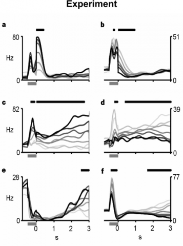

# Higher-dimensional neurons explain the tuning and dynamics of working memory cells

This model is based on that published in
Singh, R., Eliasmith, C. (2006).
Higher-dimensional neurons explain the tuning and dynamics
of working memory cells. Journal of Neuroscience. 26, 3667-3678.
[[pdf](http://compneuro.uwaterloo.ca/files/publications/singh.2006.pdf)].
It is not the exact published model
(contact the authors for the original matlab code),
but it functions the same way.

## Experimental data

Figure 1: PSTH plots during memorization. The gray bars under the axes
indicate the onset of the stimulus, and black bars above the graph
mark periods of monotonicity. The higher stimulus frequency (f1) is
marked with darker response curves. a, c, e, Positive monotonic. b, d,
f, Negative monotonic. a, b, Early neurons. c, d, Persistent
neurons. e, f, Late neurons. [Plots from Romo et al. (1999).]

## Instructions

1. To run this demo, open the somatosensory working memory.nef file in
   Nengo and 'run simulation' by right clicking the network. If that
   doesn't work, open the script after puting the .layout file in your
   layouts directory. Click the interactive plots icon to run the
   model.

2. Once it's loaded, run it for 3s by right-clicking the **Network
   Viewer**.

3. One interesting aspect of this model is that it uses adapting
   neurons (spike rates change with constant input).

4. The far more interesting thing about this model is that it explains
   the data set from Romo et al. (1999) on somatosensory
   descrimination task in the macaque. The classes of neural response
   that they identified is shown in Figure 1, above. No other model
   has been able to capture all of these response types.

5. Note that the data above is filtered with a Gaussian kernel to make
   it into smooth firing rates, you will have to compare spike
   densities. Filtering is not included in this code.

6. To see different neurons being used, go into the Nengo network
   viewer, choosed the 2D population and click the inspector
   (magnifying glass). Go down to 'neurons' and type in some value
   (less than 200 or it will be slow), and hit enter. This generates a
   new population of cells (so slightly different tuning curves). Then
   you can rerun the model.

- Look to see if you can find the classes of neuron experimentally
  identified above in the spike raster.
- For instance 'c' above has some neurons with a brief initial burst
  and then reasonably constant firing.
- As well, some neurons have very rapid bursts and then silence ('b'),
  or prolonged silence until a later increase in firing ('e'). Few
  neurons slow down firing over time (some lines in 'd').
- To verify that the full set of patterns is present, you have to run
  the simulation with a variety of inputs, and track a single neuron
  across different inputs.
